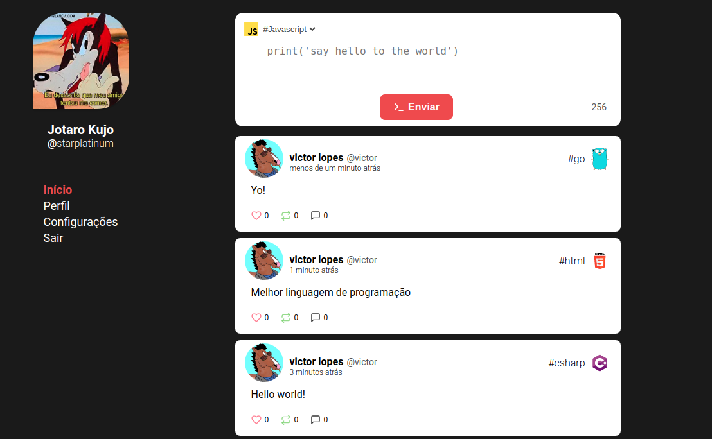
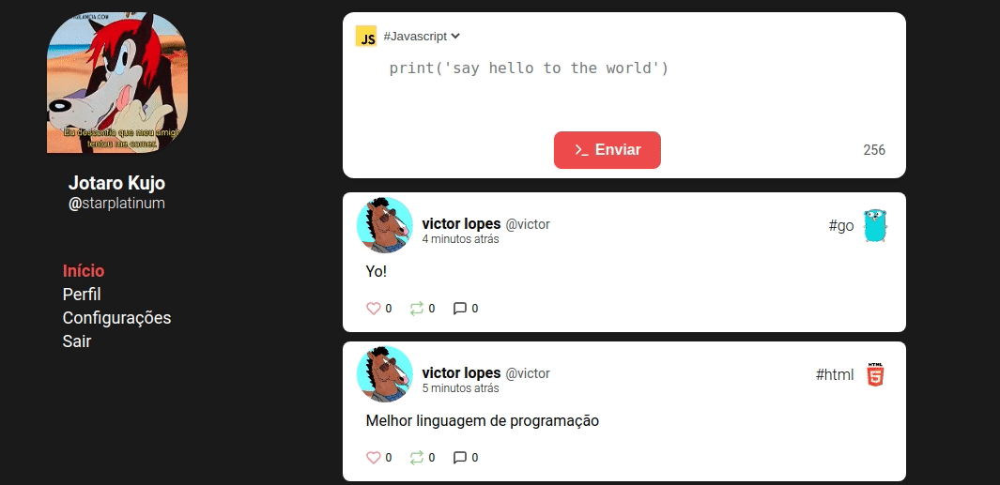

<h1 align="center">TweetDev</h1>
<h3 align="center">🚧 **Work in progress**</h3>

## Overview
TweetDev is a Tweet alike application, using [this](https://github.com/sirvaizard/tweetdev) API.

### Technologies 🛠
- [React]([https://pt-br.reactjs.org/](https://pt-br.reactjs.org/)) 
- [Socket.io]([[https://socket.io/](https://socket.io/))
- [Styled-Components]([[https://styled-components.com/](https://styled-components.com/))